# 💰 Expense Tracker in Python

A menu-driven **Expense Tracker** built using Python that helps users manage their daily expenses efficiently. The application allows users to add, view, search, update, delete, and analyze expenses. All expense data is stored permanently using a **CSV file**, ensuring it is available even after restarting the program.

---

## 📌 Features

- ➕ Add a new expense
- 📋 View all expenses
- 🔍 Search expenses by category
- 📅 Search expenses by date
- 📊 Generate monthly expense report
- 💰 Calculate total expenses
- 📂 Calculate category-wise total expenses
- ✏️ Update an existing expense
- 🗑️ Delete an expense
- 💾 Save expenses to a CSV file
- 📂 Load expenses automatically from the CSV file
- ⚠️ Input validation and exception handling
- 🖥️ Menu-driven interface

---

## 🛠️ Technologies Used

- Python 3
- CSV Module
- Functions
- Lists
- Dictionaries
- Loops
- Conditional Statements
- Exception Handling
- File Handling

---

## 📂 Project Structure

```
Expense-Tracker/
│── expense_tracker.py
│── expenses.csv
│── README.md
│── LICENSE
└── screenshots/
    ├── main-menu.png
    ├── add-expense.png
    ├── view-expenses.png
    ├── search-category.png
    ├── search-date.png
    ├── monthly-report.png
    ├── category-total.png
    ├── update-expense.png
    ├── delete-expense.png
    └── expenses-csv.png
```

---

## 🚀 How to Run

1. Clone the repository

```bash
git clone https://github.com/jgurupreethi19/Expense-Tracker.git
```

2. Navigate to the project folder

```bash
cd Expense-Tracker
```

3. Run the program

```bash
python expense_tracker.py
```

---

## 📸 Screenshots

### 🏠 Main Menu

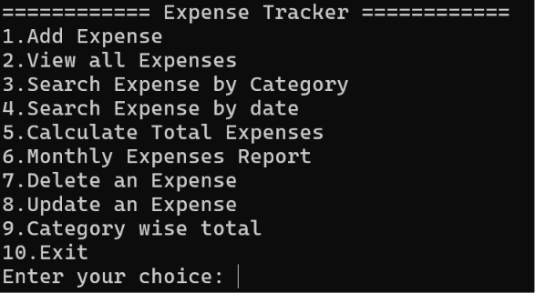

---

### ➕ Add Expense

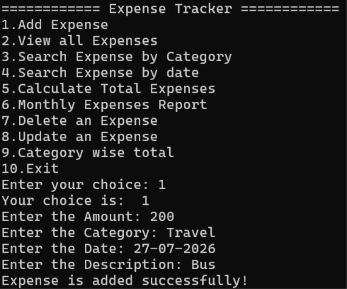

---

### 📋 View Expenses

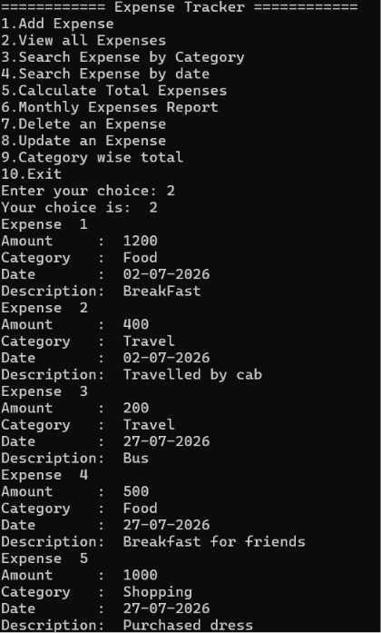

---

### 🔍 Search by Category

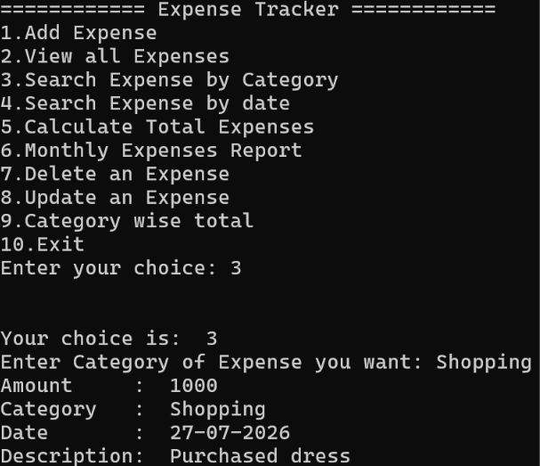

---

### 📅 Search by Date

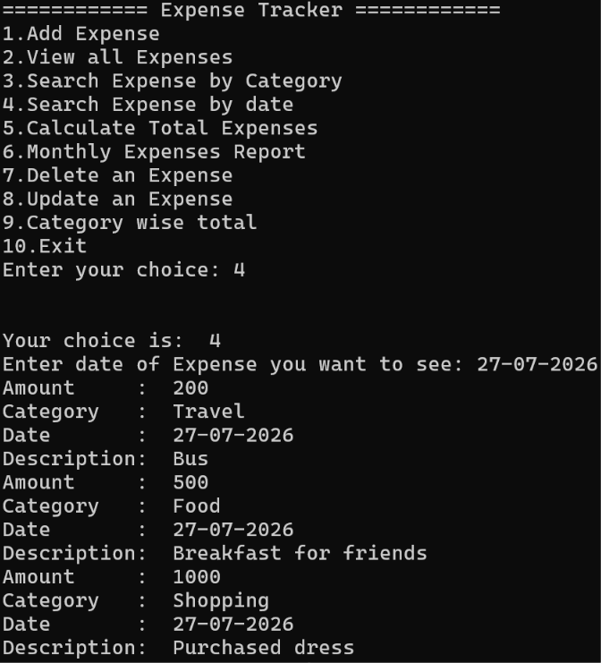

---
### 📊 Total Expense

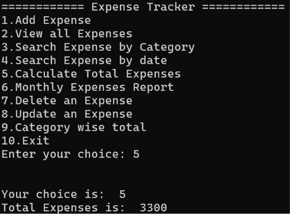

---


### 📊 Monthly Report

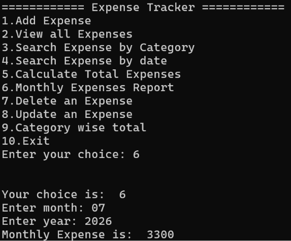

---

### 🗑️ Delete Expense

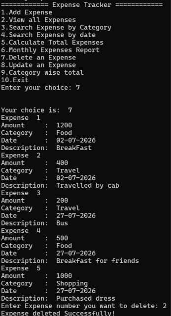

---

### ✏️ Update Expense

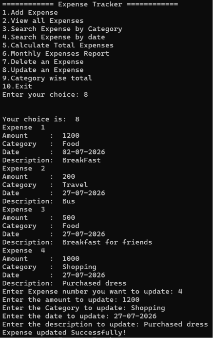

---
### 💰 Category-wise Total

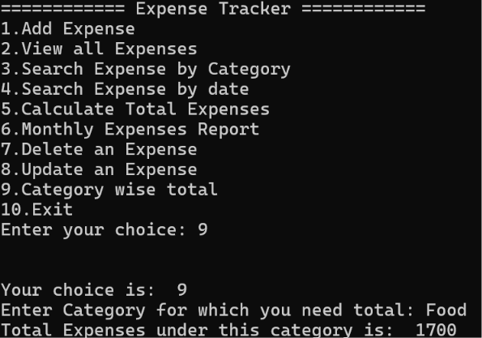

---
### Exit

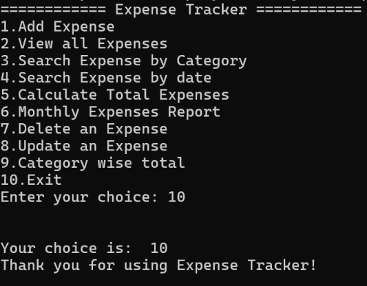

---


### 💾 CSV File

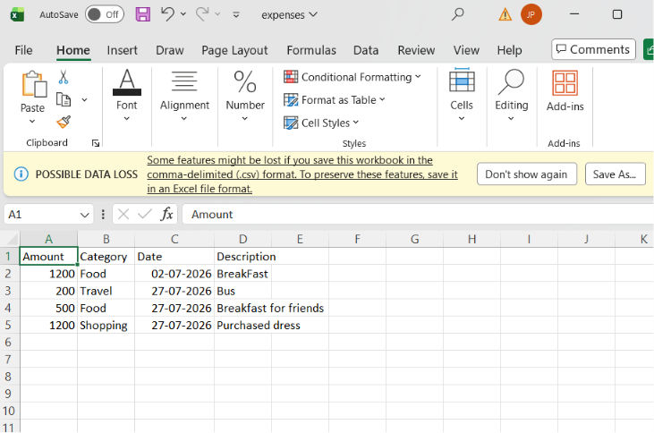

---

## 💡 Concepts Demonstrated

- Python Functions
- Dictionaries
- Lists
- CSV File Handling
- CRUD Operations
- Searching Algorithms
- Exception Handling
- Input Validation
- Menu-Driven Programming
- Data Persistence

---

## 📈 Future Improvements

- Export reports to Excel
- Graphical User Interface (Tkinter)
- SQLite/MySQL Database Integration
- Expense Charts and Analytics
- User Authentication
- Budget Planning
- Filter expenses by date range
- PDF report generation

---

## 👩‍💻 Author

**J GURUPREETHI**

If you found this project useful, consider giving it a ⭐ on GitHub!
